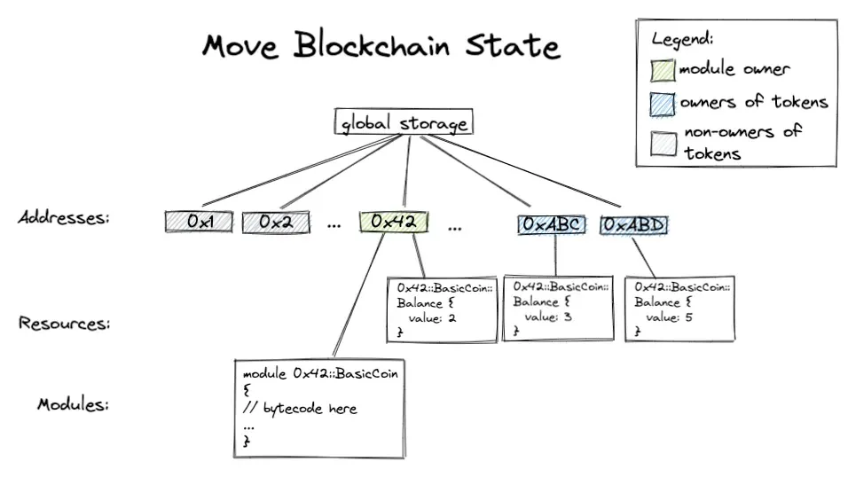

# Bronte

## Introduction

Bronte, Thunder; Bestower in Gaelic, is a set of [MoveVM](https://medium.com/@bucketprotocol/a-deep-dive-into-the-pros-and-cons-of-evm-solana-and-move-blockchains-879a4d942ee4) programs written for the atomic swapping assets between [Bitcoin](https://twentyone.world) with stable assets.
for the SUI Resource-Oriented Architecture. 

## Getting started

TBD;

## Move Blockchain State

Figure 1: Move Blockchain State by Greg Shen, Bucket Protocol.

## Acknowledgements

1. [SOV Tejo](https://www.f0nt.com/release/sov-tejo) typeface by [Worawut Thanawatanawich](https://facebook.com/worawut.thanawatanawanich)
2. [Boltz - Non-custodial Bitcoin Bridge](https://boltz.exchange)
3. [Adam Bor](https://github.com/adambor) from [Atomiq](https://atomiq.exchange)
4. [Greg Shen](https://tw.linkedin.com/in/greg-shen-b43527252) from [Bucket Protocol](https://medium.com/@bucketprotocol)

## License

This project is licensed under the terms of the MIT license.
